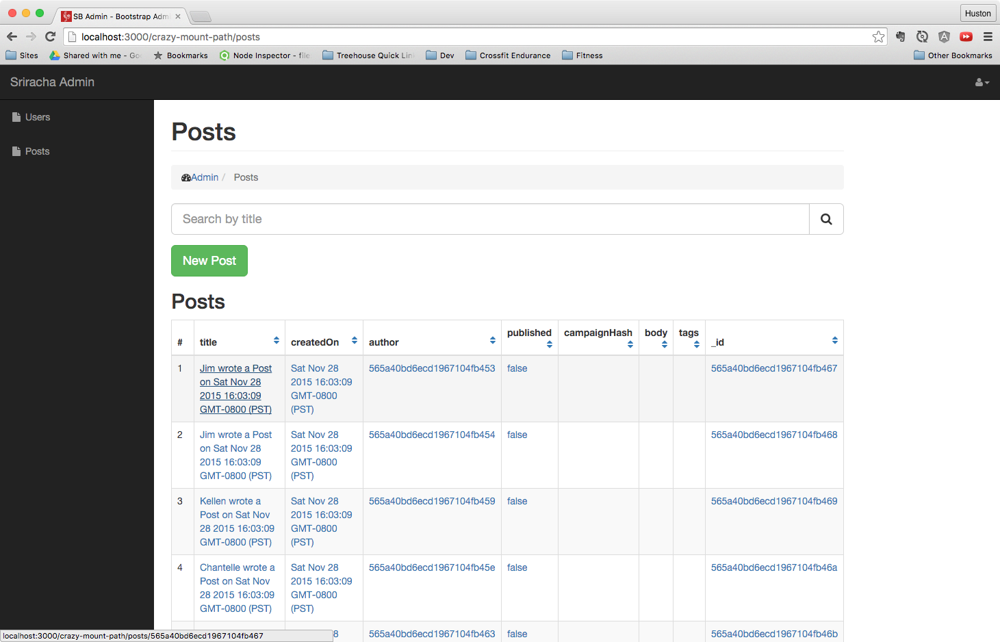

[](https://travis-ci.org/hdngr/sriracha)
[](https://coveralls.io/github/hdngr/sriracha?branch=master)
# Siracha
A super spicy Express middleware for Mongoose admin.


Sriracha is an Express app that can be mounted to any url in your app.  The admin site's routes and editing interface are generated dynamically based on your Mongoose Models.  Options are available to control the look and feel of the admin site.

## Quick Start
Install Sriracha:
```
npm install --save sriracha
```

Include Sriracha in your express app and mount it to a url.

```
var express = require('express');
var admin = require('sriracha');

app = express()
...
app.use('/admin', admin());
```

login with username `admin` and password `admin`.

Sriracha is running at `yourapp/admin`!



## Setting Options Globally
Options can be set globally through the options object passed to sriracha.  Defaults can be found in [`./lib/options.js`](./lib/options.js)
  
  ```
  app.use('/admin', admin({...}))
  ```

**username**<br> 
*default*: `'admin'` User name used to access admin backend. 

**password**<br>
*default*: `'admin'` Password used to access the admin backend.

**hideFields**:<br>
*default*: `['_id', '_v']` Fields that are hidden in all documents and collections.

**\<collection\>.searchField**
*default*: `undefined` Sriracha implements a simple (for now) autocomplete query against the specified field.

For instance, to search against the *email* field in the *User* model, you would supply the following option:

```
var options = {
...,
User: {
  searchField: 'email'
}
...
}
```

**\<collection\>.admin**
*default*: `undefined` A setting of false will hide this field from the admin.


## Setting Options on a Schema
All `<collection>` level options can be set on an individual schema. They will take precedence over the same options if they are also defined globally.  

To set schema level options, provide the option, prefixed with `admin`.

For example, the following schema would set the `lastName` to the search field for users, and would hide the `email` and `onboarding.signupDate` fields.
    
  ```
  ...
  var Schema = mongoose.Schema;

  var UserSchema = new Schema({
    lastName: {
      type: String,
      default: '',
      adminSearchField: true
    },
    ...,
    email: {
      type: String,
      admin: false
    }
    onboarding: {
      signupDate: {
        type: Date,
        admin: false
      },
      hasLoggedIn: {
        type: Boolean,
        default: false
      }
    },
  });
  ...
  ```

## Examples
Examples can be found in the `./examples` directory.  To run them:

```
git clone <this-repo-or-your-fork>
cd <this-repo-or-your-fork>
npm install
# run the app with simple setup
gulp simple
# run the app with advanced setup
gulp advanced
```

## Contributing
Contributing is anything from filing bugs, to requesting new features, to building features and their tests.  Here's how to use this repo:

```
# fork this repo
git clone <your-awesome-fork>
cd <your-awesome-fork>
git checkout -b <your-awesome-feature>
git branch -d master

# You can serve the "simple" app in development by running
# gulp simple
# in all likelihood, you should add your feature and associated options
# to the advanced app
# serve the "advanced" app in development
gulp advanced 
# add your awesome feature
# write some tests
# run those tests
gulp test
# debug those tests
mocha --debug-brk tests
# in another tab
node-inspector

# tests pass
# submit a pull request!
```
Read more about tests in [tests/tests.md](./tests/tests.md).


## Acknowledgments
Thanks [Iron Summit Media Strategies](http://www.ironsummitmedia.com/) for the awesome [Start Bootstrap Themes](http://startbootstrap.com/).

Siracha started with [SB Admin](http://startbootstrap.com/template-overviews/sb-admin/) and I used [Jade Converter](http://html2jade.org/) to turn it into Jade.
